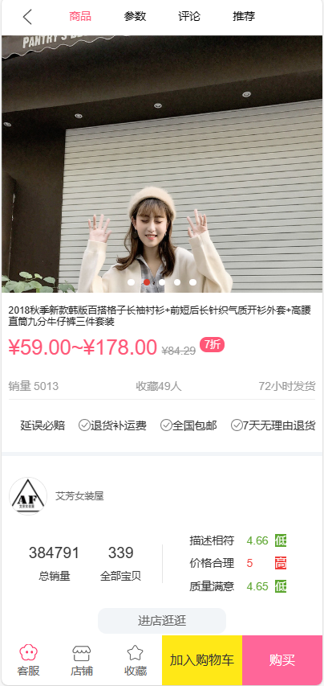
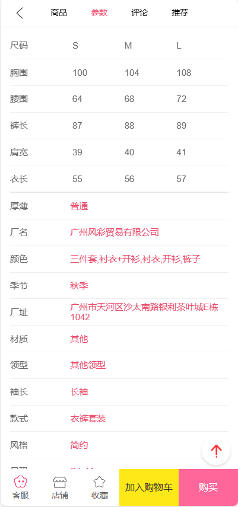

# beautiBuyMall
### 技术栈
Vue、Vue-Router、Vue-cli、Vuex、Axios、混入mixin
### 使用技术
1.组件封装（如轮播图，导航栏的统一封装等），模块化开发，工程化思想；
2.使用 Vue-Router进行路由跳转，配置一级路由和二级路由，实现页面间的跳转；
3.使用 Vuex 进行分模块数据管理，使用 Axios 进行网络异步请求；
4.项目开发的基本流程以及调试方法（devtools的使用）；
5.使用vue-lazyload实现图片懒加载，使用better-scroll实现页面的滚动效果等。
### 展示
首页

详情页



购物车

## Project setup
```
npm install
```

### Compiles and hot-reloads for development
```
npm run serve
```

### Compiles and minifies for production
```
npm run build
```

### Lints and fixes files
```
npm run lint
```

### Customize configuration
See [Configuration Reference](https://cli.vuejs.org/config/).
